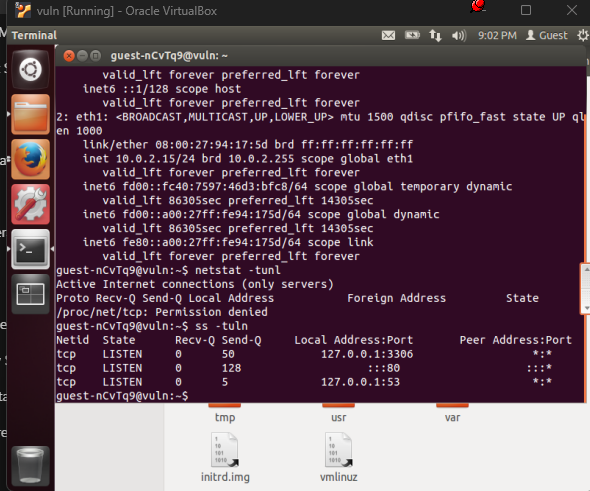
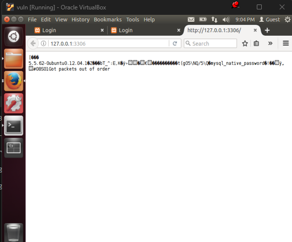
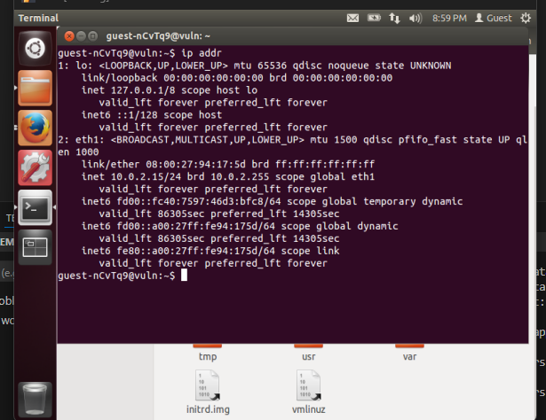

<h1>VM question</h1>

Firstly after loading the VM in oracle virtual machine in NAT network mode.

I tried some simple SQL injection and other things after first boot and the VM asked for password which was unsuccessful.

Then I checked in the terminal what all prevliges I have.......No sudo ):
Then I tried some simple things to bypass which were failed obviously

To see the ports and open ports I used ss- tuln

I found 3 open ports and 127.0.0.1:3306 was a sql port

I wrapped my head around it for a bit but I found nothing the something like sql_native_password and something hashed was written but I couldn't decode that.

I just got to know that it was some error sent by some my sql server maybe and so the sql could be a little bit vulrenable part of the VM and could be exploited....

The other port was restricted.

Then i checked the ip using ip addr and found some things....

I found some more ports of which 10.0.2.255 was unable to connect......

But 10.0.2.15 and 127.0.0.1 gave same webpage but 10.0.2.15 showed Connection is not Secure.

It was just a normal notes website where you can login and all.

<h4>I found a small vulnerablity in it , we can signup with only email and username , without a password and can login with that email without a password</h4>
<h4> So i got an idea that sql injection could work here </h4>

also I saw this Which showed that password field is insecure

The usage of GET request was another vulnerablity...

I tried many sql injetions but nothing worked on the login signup and all fields and requests of the page were mostly GET requests.....

I then started analysing and used some terminal commands to see the not read only files I could use File injection attacks but they didn't worked....

Then in the system Files I found a folder var/www with many interesting things about the page 10.0.2.15

Some SS included they were some database schema and and other db related thing..........

<h2> Important files I found </h2>

These creds are of same notes website as I checked that the email already exists...
The user_id of admin user maybe is 1
Username - Piyush Bhai
Pass- hashed
emial - piyush@saic.com
And a created_at date given......

I tried many things with it and tried to unhash the password and everything but that didn't worked.
Further I tried many sql injections with the email of the admin I found but didn't got much ...

I found that the jwl key was HS256

Then I tried to find more on the Jwt-Tokens of the website and found my own token....

I tried to elevate the previlges with changing and with jwt.io to do it:
userid-1
user:admin

but then I realized that the jwt token has a expiry date .......
So its not of much use....

The PHPSESSION id was also not much use......
