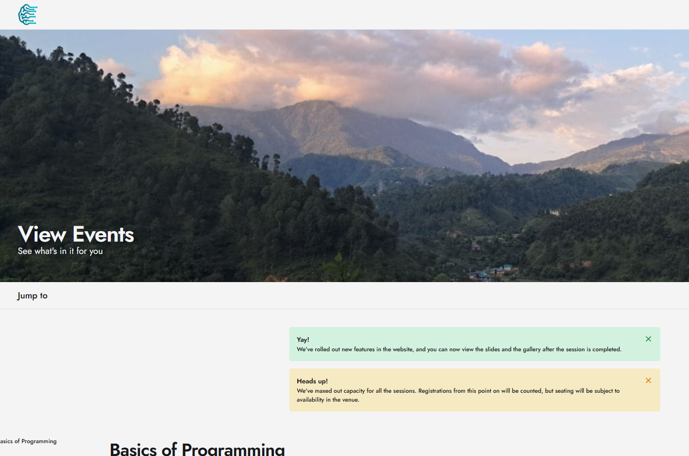

<h1>Hosting 2 websites</h1>

I faced many issues in this question

and sorry you can also see some files changed from what I have documented as I tried multiple times to do the problem with different ways

After cloning and all and making the dockerfile and yml file was not that tough

Firstly I was performing the all the things in vs code windows terminal which was more probamatic as installing dependencies was tough

Mostly Nutrient-Tracker with rails was a big issue the TIP file was easier to build

I Used bridge network for inter-container communication.
and
Expose only necessary ports to avoid conflicts.

1.I got errors related to the Gemfile first of the Nutrient-Tracker

2.I had to recreate the Gemfile.

3.Then bundle install gave many problems

<h6>4.Then after many such problems i switched to WSL Ubuntu</h6>

5.After solving many such errors in ubuntu I somehow builded but then the rails migration gave error in the nutrient-tracker

6.The TIP project was working completely and was working on my localhost browser too fine but the rails was giving many issues

7.Some more errors came for which I also made an entrypoint.sh file for the entry point .

8.Got many errors in the db files like

I fixed these errors by chanding some fields and all in the db files

Also got many bycrypt and nokogiri erros

9.After doing all this and ignoring some erros and containers ran but this was not the correct approach.

10.So i was able to run the TIP Website perfectly on my localhost but not the Nutrient-Tracker website....

11.Also found some problems in the
